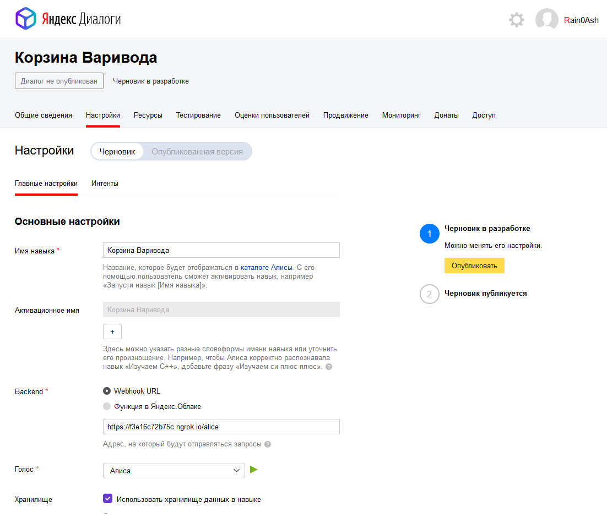
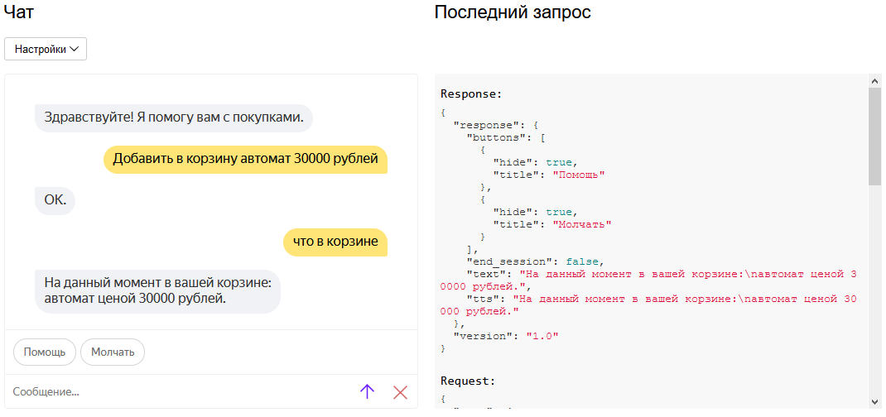
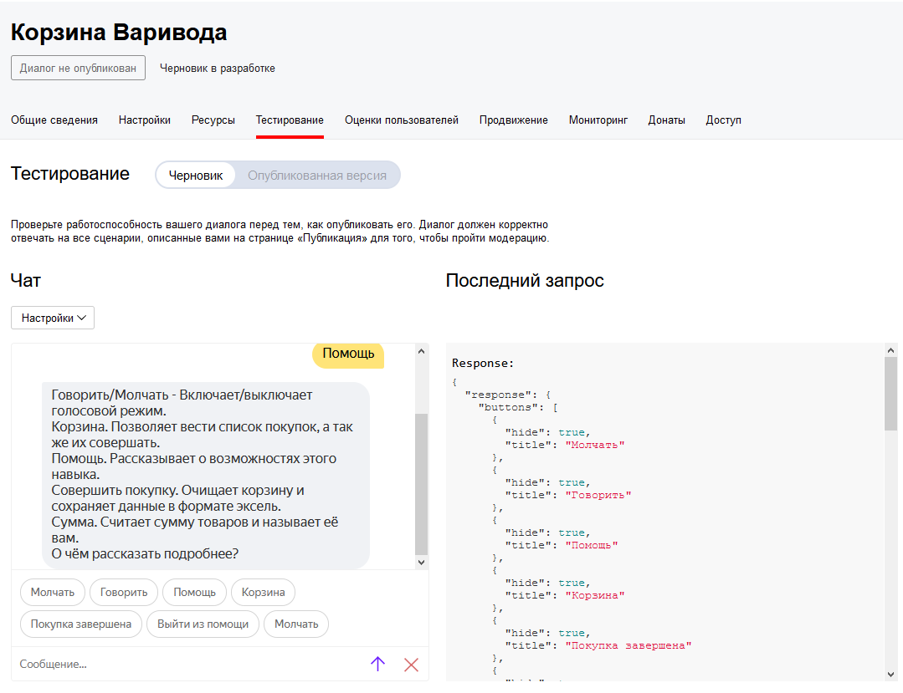
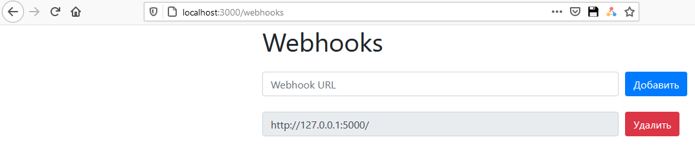

<p align="center">МИНИСТЕРСТВО НАУКИ  И ВЫСШЕГО ОБРАЗОВАНИЯ РОССИЙСКОЙ ФЕДЕРАЦИИ<br>
Федеральное государственное автономное образовательное учреждение высшего образования<br>
"КРЫМСКИЙ ФЕДЕРАЛЬНЫЙ УНИВЕРСИТЕТ им. В. И. ВЕРНАДСКОГО"<br>
ФИЗИКО-ТЕХНИЧЕСКИЙ ИНСТИТУТ<br>
Кафедра компьютерной инженерии и моделирования</p>
<br>
<h3 align="center">Отчёт по лабораторной работе № 2<br> по дисциплине "Программирование"</h3>
<br><br>
<p>студента 1 курса группы ПИ-б-о-201(2)<br>
Варивода Богдана Евгеньевича<br>
направления подготовки 09.03.04 "Программная инженерия"</p>
<br><br>
<table>
<tr><td>Научный руководитель<br> старший преподаватель кафедры<br> компьютерной инженерии и моделирования</td>
<td>(оценка)</td>
<td>Чабанов В.В.</td>
</tr>
</table>
<br><br>
<p align="center">Симферополь, 2020</p>
<hr>

## Постановка задачи
1.  Разработать и зарегистрировать навык для Алисы на сервисе Яндекс.Диалоги;
2.  В качестве backend-a для навыка реализовать приложение на языке С++ выполняющее следующие функции:
    1.  Составление продуктовой корзины:
        -   Добавление продукта в корзину;
        -   Удаление продукта из корзины;
        -   Очистка корзины;
        -   Вывод списка товаров в корзине;
        -   Подсчёт стоимости товаров в корзине.
    2.  Вывод справочной информации по навыку;
    3.  Регистрацию webhook-ов сторонних сервисов;
    4.  Отправку данных на сторонние сервисы.
3.  В качестве стороннего сервиса реализовать приложение на языке Python выполняющее следующие функции:
    1.  Ожидание данных о покупке;
    2.  Сохранение поступивших данных в excel-документ.

**Цель работы:** 
1.  Получить представления о структуре post-запроса;
2.  Изучить webhooks как метод взаимодействия web-приложений;

## Цель работы
Целью работы является научится создавать приложения для работы с сервисом Яндекс.Диалоги при помощи технологии вебхуков, а также работать с документами xlsx при помощи библиотеки.

Каталоги:
[[Сервер]](./Server) [[Клиент]](./Client) [[Excel]](./Excel)

## Выполнение работы

Для выполнения данной лабораторной работы необходимо было зарегистрироваться на сервисе Яндекс.Диалоги, после чего создать навык для Алисы. Далее следует заполнить поля формы (рис. 1) и опубликовать навык.

1. Скриншот со страницы настройки навыка Алисы:



Рисунок 1. Страница настройки

2. Далее на сервере была написана логика работы с API сервиса диалогов при помощи webhook POST запроса.

Для получения данных в сообщении (к примеру цены) была написана функция парсинга сообщения. Также API может сам определять тип данных.

Следующим шагом был разработан сервер. Требовалось создать обработчики на три пути:

-Разработка GET обработчика на путь "/webhooks" для открытия страницы вебхуков
-Разработка POST обработчика на путь "/webhooks" для добавления и удаления вебхуков
-Разработка POST обработчика на путь "/alice" для работы с сервисом Яндекс.Диалоги

Для достижения высокой читабельности повторяющийся код был выделен в отдельные функции и заголовочные файлы, которые помещены по пути [[Common]](./Server/include/common)

Файл [University.cpp](./Server/University.cpp) содержит функцию входа *main*.

Во время работы сервера в файл лога выводится отладочная информация.

3. Был написан функционал Корзины согласно техническому заданию



Рисунок 2. Функционал корзины

4. Был написан функционал раздела Помощь согласно техническому заданию



Рисунок 3. Функционал помощи

4. При переходе по пути webhooks при помощи GET-запроса требовалось создать страницу управления подключенными вебхуками с возможностью их добавления и удаления.



Рисунок 4. Функционал страницы управления вебхуками

4. Клиентское приложение состоит из буфера, который каждые n запросов переносит свою информацию в [[Excel]](./Excel/data.xlsx) файл.

5. Полный исходный код сервера:
```c++
// -------
// <COMMON>
// -------

// -------
// <utils.hpp>
// -------
#pragma once

#include <fstream>
#include <string>

inline void replace(std::string& str, const std::string& from, const std::string& to)
{
	size_t position = str.find(from);
	while (position != std::string::npos)
	{
		str.replace(position, from.size(), to);
		position = str.find(from, position + to.size());
	}
}

inline bool is_empty(std::ifstream& stream)
{
	return stream.peek() == std::ifstream::traits_type::eof();
}

inline void trim_start(std::string& s)
{
	s.erase(s.begin(), std::find_if(s.begin(), s.end(), [](const unsigned char& ch)
	{
		return !std::isspace(ch);
	}));
}

inline void trim_end(std::string& s)
{
	s.erase(std::find_if(s.rbegin(), s.rend(), [](const unsigned char& ch)
	{
		return !std::isspace(ch);
	}).base(), s.end());
}

inline void trim(std::string& s)
{
	trim_start(s);
	trim_end(s);
}

inline std::string trim_copy_start(std::string s)
{
	trim_start(s);
	return s;
}

inline std::string trim_copy_end(std::string s)
{
	trim_end(s);
	return s;
}

inline std::string trim_copy(std::string s)
{
	trim(s);
	return s;
}

// -------
// <config.h>
// -------
#pragma once

#include <fstream>
#include <string>

#include "utils.hpp"
#include "nlohmann/json.hpp"

using json = nlohmann::json;

const std::string cfg_name = "config.json";

bool try_read_config(json& config)
{
    config = json();
    
    std::ifstream config_file(cfg_name);
    if (config_file.is_open() && !is_empty(config_file))
    {
        log(u8"Идет десериализация файла конфигурации.", message_type::info);

        try
        {
            config_file >> config;
        }
        catch (std::exception& ex)
        {
            log(std::string(u8"Ошибка десериализации файла конфигурации ") + ex.what(), message_type::error);
            config_file.close();
            return false;
        }

        log(u8"Десериализация файла кофигурации успешно завершена.", message_type::info);
        config_file.close();

        return true;
    }
    
    if (config_file.good())
    {
        log(u8"Файл конфигурации существует, но его не удалось открыть.", message_type::error);
    }
    else
    {
        log(u8"Файл конфигурации не существует", message_type::warning);
    }
    
    config["webhooks"] = json::array();
    
    return false;
}

bool try_save_config(const json& config)
{
    std::ofstream config_file(cfg_name);

    if (config_file.is_open())
    {
        log(u8"Запись файла конфигурации", message_type::info);
        
        try
        {
            config_file << config.dump(4);
        }
        catch (std::exception& _)
        {
            config_file.close();
            return false;
        }
        
        config_file.close();
        return true;
    }
    
    log(u8"Не удалось создать файл конфигурации.", message_type::error);
    return false;
}

// -------
// <logger.h>
// -------
#pragma once

#include <fstream>

static std::ofstream logger("log.txt");

enum class message_type
{
    info,
    warning,
    error,
    critical,
    fatal
};

bool log(const std::string& message, const message_type& type = message_type::info)
{
    if (!logger.is_open())
    {
        return false;
    }
    
    const std::time_t time = std::time(nullptr);
    std::string message_type;
    
    switch (type)
    {
        case message_type::info:
            message_type = "Info";
            break;
        case message_type::warning:
            message_type = "Warning";
            break;
        case message_type::error:
            message_type = "Error";
            break;
        case message_type::critical:
            message_type = "Critical";
            break;
        case message_type::fatal:
            message_type = "Fatal";
            break;
        default:
            message_type = "Unknown";
            break;
    }

    char buffer[256];
    tm tm;
    localtime_s(&tm, &time);
    strftime(buffer, sizeof(buffer), "%a %b %d %H:%M:%S %Y", &tm);

    logger << "[" << message_type <<  "](" << std::string(buffer) << ") " << message << std::endl;
    return true;
}

// -------
// <hooks.h>
// -------
#pragma once

#include <fstream>

#include "config.h"
#include "cpp_httplib/httplib.h"
#include "nlohmann/json.hpp"

using json = nlohmann::json;

const std::string page_name = "webhooks.html";
const std::string hook_template =
    R"(
    <div class="form-row align-items-center">
        <div class="col">
            <input type="text" value="{Webhook URL}" class="form-control mb-2" disabled>
        </div>
    
        <div class="col">
            <button type="submit" name="del" value="{Webhook URL}" class="btn btn-danger mb-2">Удалить</button>
        </div>
    </div>)";

json config;

std::string generate_hook_page()
{
    std::ifstream webpage_file(page_name);
    std::string webpage;
    
    if (!webpage_file.is_open())
    {
        log(u8"Файл шаблона не удалось открыть", message_type::error);
        return "";
    }

    std::getline(webpage_file, webpage, '\0');
    webpage_file.close();
    
    if (config.empty())
    {
        try_read_config(config);
    }
    
    std::string hooks;
    if (!config["webhooks"].empty())
    {
        for (const auto& hook : config["webhooks"])
        {
            if (!hook.is_string())
            {
                log(std::string("В файле конфигурации обнаружен неверный тип ") + hook.type_name(), message_type::error);
                continue;
            }

            std::string htemplate = hook_template;
            replace(htemplate, "{Webhook URL}", hook.get<std::string>());
            hooks += htemplate;
        }
    }

    replace(webpage, "{webhooks_list}", hooks);
    return webpage;
}

void hooks_get(const httplib::Request& req, httplib::Response& res)
{
    res.set_content(generate_hook_page(), "text/html; charset=UTF-8");
}

bool try_del_hook(const httplib::Request& req, httplib::Response& res)
{
    std::string value = req.get_param_value("del");

    if (value.empty())
    {
        log("Пустой запрос на удаление вебхука.", message_type::warning);
        return false;
    }
    
    log(std::string("В POST получен параметр del=") + value, message_type::info);

    if (config["webhooks"].empty())
    {
        log("Вебхуки отсутствуют.", message_type::warning);
        return true;
    }

    const size_t size = config["webhooks"].size();
    for (size_t i = 0; i < size; i++)
    {
	    std::string hook = config["webhooks"][i];
        if (hook == value)
        {
            config["webhooks"].erase(config["webhooks"].begin() + i);
            log(std::string("Был удален вебхук ") + hook, message_type::info);
        }
    }
	
    return true;
}

bool contains_hook(const std::string& value)
{
    if (config["webhooks"].empty())
    {
        return false;
    }

	for (const auto& item : config["webhooks"])
	{
        if (item.is_string() && item.get<std::string>() == value)
        {
            return true;
        }
	}

    return false;
}

bool try_set_hook(const httplib::Request& req, httplib::Response& res)
{
    std::string value = req.get_param_value("set");
    if (value.empty())
    {
        log("Пустой запрос на создание вебхука.", message_type::info);
        return false;
    }

    log(std::string("В POST получен параметр set=") + value, message_type::info);

    if (contains_hook(value))
    {
        log(std::string("Вебхук ") + value + std::string(" уже существует в конфигурации."), message_type::warning);
        return true;
    }

    config["webhooks"].push_back(value);
    log(std::string("Добавлен вебхук ") + value, message_type::info);
    return true;
}

void hooks_post(const httplib::Request& req, httplib::Response& res)
{
    if (config.empty())
    {
        try_read_config(config);
    }

	if (req.has_param("set"))
    {
        try_set_hook(req, res);
        try_save_config(config);
    }
    else if (req.has_param("del"))
    {
        try_del_hook(req, res);
        try_save_config(config);
    }

    res.set_content(generate_hook_page(), "text/html; charset=UTF-8");
}

// -------
// <yandex.h>
// -------
#pragma once

#include "config.h"
#include "cpp_httplib/httplib.h"
#include "nlohmann/json.hpp"

using json = nlohmann::json;

enum class voice_type
{
	silent,
	voice
};

static std::map<voice_type, std::string> voice_type_to_string
{
	{voice_type::silent, "silent"},
	{voice_type::voice, "voice"}
};

static std::map<std::string, voice_type> voice_type_from_string
{
	{"silent", voice_type::silent},
	{"voice", voice_type::voice}
};

enum class skill_type
{
	basic,
	help
};

static std::map<skill_type, std::string> skill_type_to_string
{
	{skill_type::basic, "default"},
	{skill_type::help, "help"}
};

static std::map<std::string, skill_type> skill_type_from_string
{
	{"default", skill_type::basic},
	{"help", skill_type::help}
};

static json sessions = json::array();

const json help_button =
{
	{
		{"title", u8"Помощь"},
		{"hide", true}
	},
};

const json voice_button =
{
	{"title", u8"Говорить"},
	{"hide", true}
};

const json silent_button =
{
	{"title", u8"Молчать"},
	{"hide", true}
};

const json help_buttons =
{
	{
		{"title", u8"Молчать"},
		{"hide", true}
	},
	{
		{"title", u8"Говорить"},
		{"hide", true}
	},
	{
		{"title", u8"Помощь"},
		{"hide", true}
	},
	{
		{"title", u8"Корзина"},
		{"hide", true}
	},
	{
		{"title", u8"Покупка завершена"},
		{"hide", true}
	},
	{
		{"title", u8"Выйти из помощи"},
		{"hide", true}
	},
};

struct message
{
	std::string text;
	std::string tts;

	message() = default;

	message(const std::string& text, const char* tts)
	{
		this->text = text;
		this->tts = tts;
	}

	message(const std::string& text, const std::string& tts)
	{
		this->text = text;
		this->tts = tts;
	}

	message(const std::string& text, const bool& voice = true)
	{
		this->text = text;

		if (voice)
		{
			this->tts = text;
		}
	}
};

static std::map<std::string, message> help_messages =
{
	{u8"молчать", message(u8"Я перестану озвучивать сообщения.")},
	{u8"говорить", message(u8"Я начну озвучивать сообщения")},
	{u8"помощь", message(u8"Я расскажу вам подробно о возможностях.")},
	{u8"корзина",message(u8"Чтобы добавить что-то, скажите \"Добавить в корзину {предмет} {цена} рублей\".\nЧтобы удалить что-то, скажите \"Удалить из корзины {предмет}\".")},
	{u8"сумма", message(u8"Посчитать стоимость товаров в корзине.")},
	{u8"покупка завершена", message(u8"Очистить корзину и передам список покупок привязанным вебхукам.")},
	{u8"выйти из помощи", message(u8"Обращайся еще")}
};

bool is_new_session(const json& request)
{
	return request["session"]["new"].get<bool>();
}

bool is_help_mode(const json& session)
{
	return session["skill_type"].get<std::string>() == skill_type_to_string[skill_type::help];
}

bool is_silent_mode(const json& session)
{
	return session["voice_type"].get<std::string>() == voice_type_to_string[voice_type::silent];
}

json generate_yandex_response(const message& message, const json& buttons, const json& session = nullptr,
                         const bool& end = false)
{
	json response =
	{
		{
			"response",
			{
				{"buttons", buttons},
				{"end_session", end}
			}
		},
		{"version", "1.0"}
	};

	if (!message.text.empty())
	{
		response["response"]["text"] = message.text;
	}

	if (session != nullptr)
	{
		if (is_silent_mode(session))
		{
			response["response"]["buttons"].push_back(voice_button);
			response["response"]["tts"] = std::string("sil <[500]>"); //попросим помолчать
			return response;
		}

		if (!message.tts.empty())
		{
			response["response"]["tts"] = message.tts;
		}

		response["response"]["buttons"].push_back(silent_button);
		return response;
	}

	return response;
}

json generate_help_yandex_responce(const std::string& command, json& session)
{
	if (command == u8"выйти из помощи")
	{
		session["skill_type"] = skill_type_to_string[skill_type::basic];
		return generate_yandex_response(help_messages[command], help_button, session);
	}
	
	return generate_yandex_response(
		help_messages.find(command) != help_messages.end()
			? message(help_messages[command].text + std::string(u8"\nО чем еще рассказать?"))
			: message(u8"С этим я не могу вам помочь.", u8"С +этим я не мог+у вам пом+очь."),
		help_buttons, session);
}

void set_responce(httplib::Response& res, const message& message, const json& buttons, const json& session, const bool& end = false)
{
	res.set_content(generate_yandex_response(message, buttons, session, end).dump(4), "application/json; charset=UTF-8");
}

void on_silent_command(httplib::Response& res, json& session)
{
	session["voice_type"] = voice_type_to_string[voice_type::silent];
	set_responce(res, message(u8"Молчу, молчу", false), help_button, session);
}

void on_voice_command(httplib::Response& res, json& session)
{
	session["voice_type"] = voice_type_to_string[voice_type::voice];
	set_responce(res, message(u8"Хорошо.", u8"Хорош+о."), help_button, session);
}

void on_help_command(httplib::Response& res, json& session)
{
	const static std::string text =
		std::string(u8"Говорить/Молчать - Включает/выключает голосовой режим.\n") +
		std::string(u8"Корзина. Позволяет вести список покупок, а так же их совершать.\n") +
		std::string(u8"Помощь. Рассказывает о возможностях этого навыка.\n") +
		std::string(u8"Совершить покупку. Очищает корзину и сохраняет данные в формате эксель.\n") +
		std::string(u8"Сумма. Считает сумму товаров и называет её вам.\n") +
		std::string(u8"О чём рассказать подробнее?");

	session["skill_type"] = skill_type_to_string[skill_type::help];
	set_responce(res, message(text), help_buttons, session);
}

void on_clear_cart_command(httplib::Response& res, json& session)
{
	if (session["cart"].empty())
	{
		set_responce(res, message(u8"Корзина и так пуста.", u8"Корз+ина и так пуста."), help_button, session);
		return;
	}

	session.erase("cart");
	session["cart"] = json::array();
	set_responce(res, message(u8"Корзина пуста.", u8"Корз+ина пуста."), help_button, session);
}

void on_what_in_cart_command(httplib::Response& res, json& session)
{
	if (session["cart"].empty())
	{
		set_responce(res, message(u8"Ваша корзина пуста.", u8"Ваша корзина пуста."), help_button, session);
		return;
	}

	std::string text = u8"На данный момент в вашей корзине:";
	for (auto& item : session["cart"])
	{
		const int price = item["price"].get<int>();

		text += "\n" + item["item"].get<std::string>() + u8" ценой " + std::to_string(price);

		if (price >= 10 && price <= 20 || price % 10 == 0)
		{
			text.append(u8" рублей,");
		}
		else if (price % 10 == 1)
		{
			text.append(u8" рубль,");
		}
		else if (price % 10 > 0 && price % 10 < 5)
		{
			text.append(u8" рубля,");
		}
		else
		{
			text.append(u8" рублей,");
		}
	}

	text[text.size() - 1] = '.';

	set_responce(res, message(text), help_button, session);
}

bool try_send_post_on_purchase_completed_command(const std::string& id, json& session)
{
	try
	{
		const json cart =
		{
			{"user_id", id},
			{"cart", session["cart"]}
		};

		json cfg;
		try_read_config(cfg);

		for (std::string hook : cfg["webhooks"])
		{
			trim(hook);
			replace(hook, "https://", "http://");
			
			if (hook.find("http://") != 0)
			{
				continue;
			}

			if (hook.find('/', 7) == std::string::npos)
			{
				hook.push_back('/');
			}
			
			const size_t index = hook.find('/', static_cast<std::string>("http://").size());

			if (index == std::string::npos)
			{
				log(std::string(u8"При отправке запроса было обнаружена невалидность вебхука: ") + hook, message_type::warning);
				continue;
			}
			
			httplib::Client client(hook.substr(0, index).c_str());
			client.Post(hook.substr(index, std::string::npos).c_str(), cart.dump(4), "application/json; charset=UTF-8");
			log(std::string(u8"Отправляется запрос на ") + hook, message_type::info);
		}

		return true;
	}
	catch (const std::exception& ex)
	{
		log(std::string(u8"Произошла критическая ошибка во время отправки запросов: ") + ex.what(), message_type::critical);
		return false;
	}
}

void on_purchase_completed_command(httplib::Response& res, json& session, std::string& id)
{
	if (session["cart"].empty())
	{
		set_responce(res, message(u8"Ваша корзина пуста.", u8"Ваша корзина пуста."), help_button, session);
		return;
	}

	if (!try_send_post_on_purchase_completed_command(id, session))
	{
		set_responce(res, message(u8"Произошла неизвестная ошибка!\nПопробуйте еще раз или дождитесь ее исправления."), help_button, session);
		return;
	}

	session.erase("cart");
	session["cart"] = json::array();

	set_responce(res, message(u8"Заходите ещё!", u8"Заход+ите ещ+ё!"), help_button, session, true);
}

void on_price_command(httplib::Response& res, json& session, const json& request)
{
	size_t size = request["request"]["nlu"]["tokens"].size();
	size_t fullprice = 0;

	for (auto& item : session["cart"])
	{
		fullprice += item["price"].get<size_t>();
	}

	if (fullprice <= 0)
	{
		set_responce(res, message(u8"У вас в корзине нет товаров.", u8"У вас в корз+ине нет тов+аров."), help_button,session);
		return;
	}

	std::string text = u8"В общей сумме у вас товаров на " + std::to_string(fullprice);
	std::string tts = u8"В +общей с+умме у вас тов+аров на " + std::to_string(fullprice);

	if (fullprice >= 10 && fullprice <= 20 || fullprice % 10 == 0)
	{
		text.append(u8" рублей.");
		tts.append(u8" рубл+ей.");
	}
	else if (fullprice % 10 == 1)
	{
		text.append(u8" рубль.");
		tts.append(u8" рубль.");
	}
	else if (fullprice % 10 > 0 && fullprice % 10 < 5)
	{
		text.append(u8" рубля.");
		tts.append(u8" рубл+я.");
	}
	else
	{
		text.append(u8" рублей.");
		tts.append(u8" рубл+ей.");
	}

	set_responce(res, message(text, tts), help_button, session);
}

void on_add_to_cart_command(httplib::Response& res, json& session, const json& request)
{
	const size_t size = request["request"]["nlu"]["tokens"].size();
	std::string item_name;
	size_t price = 0;
	int index = 0;
	bool ns_index = false;

	for (auto item : request["request"]["nlu"]["entities"])
	{
		if (item["type"].get<std::string>() == "YANDEX.NUMBER")
		{
			index = item["tokens"]["start"];
			const auto val = item["value"].get<long long int>();

			if (val <= 0)
			{
				set_responce(res, message(u8"Цена не может быть отрицательной или равной нулю.", u8"Цен+а не м+ожет б+ыть отриц+ательной или равной нулю."), help_button, session);
				return;
			}
			
			price = val;
			ns_index = true;
			break;
		}
	}
	
	if (size == 3)
	{
		set_responce(res, message(u8"Не указано что добавить в корзину."), help_button, session);
		return;
	}

	if (!ns_index)
	{
		set_responce(res, message(u8"Не указана цена товара"), help_button, session);
		return;
	}

	if (index == 3)
	{
		set_responce(res, message(u8"Не указано название товара"), help_button, session);
		return;
	}

	for (int i = 3; i < index; ++i)
	{
		item_name.append(request["request"]["nlu"]["tokens"][i].get<std::string>());

		if (i < index - 1)
		{
			item_name.append(" ");
		}
	}

	const json item =
	{
		{"item", item_name},
		{"price", price}
	};
	
	session["cart"].push_back(item);

	set_responce(res, message(u8"ОК.", u8"Ок+ей."), help_button, session);
}

void on_remove_from_cart_command(httplib::Response& res, json& session, const json& request)
{
	const size_t size = request["request"]["nlu"]["tokens"].size();

	std::string item_name;

	for (size_t i = 3; i < size; ++i)
	{
		item_name.append(request["request"]["nlu"]["tokens"][i].get<std::string>());
		item_name.append(" ");
	}

	if (item_name.empty())
	{
		set_responce(res, message(u8"Не указано что убрать из корзины"), help_button, session);
		return;
	}

	item_name.pop_back();

	for (size_t i = 0; i < session.size(); i++)
	{
		auto& item = session[i];
		if (item["item"].get<std::string>() == item_name)
		{
			session["cart"].erase(session["cart"].begin() + i);
			set_responce(res, message(u8"Удалила.", u8"Удал+ила."), help_button, session);
			return;
		}
	}

	log(u8"Предмет не был найден", message_type::info);
	set_responce(res, message(u8"Такого предмета в вашей корзине нету.", u8"Так+ого предмета в в+ашей корз+ине н+ету."), help_button, session);
}

inline void on_default_command(httplib::Response& res, json& session)
{
	set_responce(res, message(u8"Я не знаю такую команду.", u8"Я не зн+аю так+ую ком+анду."), help_button, session);
}

json* find_session(const std::string& id)
{
	for (auto& session : sessions)
	{
		if (session["user_id"].get<std::string>() == id)
		{
			return &session;
		}
	}

	return nullptr;
}

void on_new_session(httplib::Response& res, const std::string& id)
{
	json* session_ptr = find_session(id);

	if (session_ptr == nullptr)
	{
		const json session =
		{
			{"user_id", id},
			{"skill_type", skill_type_to_string[skill_type::basic]},
			{"voice_type", voice_type_to_string[voice_type::voice]},
			{"cart", json::array()}
		};

		sessions.push_back(session);
		set_responce(res, message(u8"Здравствуйте! Я помогу вам с покупками.", u8"Здр+авствуйте! Я помог+у вам с пок+упками."), help_button, session);
		return;
	}

	json& session = *session_ptr;
	session["skill_type"] = skill_type_to_string[skill_type::basic];
	session["voice_type"] = voice_type_to_string[voice_type::voice];
	set_responce(res, message(u8"Здравствуйте! Я помогу вам с покупками.", u8"Здр+авствуйте! Я помог+у вам с пок+упками."), help_button, session);
}

void alice_yandex_hook(const httplib::Request& req, httplib::Response& res)
{
	json request = json::parse(req.body);

	std::string id = request["session"]["application"]["application_id"].get<std::string>();
	json response;
	json* session_ptr = find_session(id);

	if (is_new_session(request))
	{
		on_new_session(res, id);
		return;
	}

	if (session_ptr == nullptr)
	{
		set_responce(res, message(u8"Извините, произошла ошибка. Возможно сессия была сброшена.", u8"Извин+ите, произошл+а ош+ибка. Возможно сессия была сброшена."), help_button,
		             nullptr, true);
		return;
	}

	json& session = *session_ptr;

	const std::string command = request["request"]["command"].get<std::string>();

	if (is_help_mode(session))
	{
		res.set_content(generate_help_yandex_responce(command, session).dump(4), "application/json; charset=UTF-8");
		return;
	}

	if (command == u8"молчать")
	{
		on_silent_command(res, session);
	}
	else if (command == u8"говорить")
	{
		on_voice_command(res, session);
	}
	else if (command == u8"помощь")
	{
		on_help_command(res, session);
	}
	else if (command == u8"очистить корзину" || command == u8"очисти корзину")
	{
		on_clear_cart_command(res, session);
	}
	else if (command == u8"что в корзине" || command == u8"корзина")
	{
		on_what_in_cart_command(res, session);
	}
	else if (command == u8"покупка завершена" || command == u8"завершить")
	{
		on_purchase_completed_command(res, session, id);
	}
	else if (command == u8"сумма" || command == u8"цена")
	{
		on_price_command(res, session, request);
	}
	else if (command.find(u8"добавить в корзину") == 0 || command.find(u8"добавь в корзину") == 0)
	{
		on_add_to_cart_command(res, session, request);
	}
	else if (command.find(u8"удалить из корзины") == 0 || command.find(u8"удали из корзины") == 0 || command.
		find(u8"убрать из корзины") == 0 || command.find(u8"убери из корзины") == 0)
	{
		on_remove_from_cart_command(res, session, request);
	}
	else
	{
		on_default_command(res, session);
	}
}

// -------
// <University.cpp>
// -------
#include <cpp_httplib/httplib.h>
#include <common/logger.h>

#include "common/hooks.h"
#include "common/yandex.h"
#include "include/nlohmann/json.hpp"

using json = nlohmann::json;
using namespace httplib;

const std::string host = "localhost";
constexpr int port = 3000;

int main()
{
    Server srv;

    srv.Get("/webhooks", hooks_get);
    srv.Post("/webhooks", hooks_post);

    srv.Post("/alice", alice_yandex_hook);

    log(std::string("Сервер успешно запустился по адресу ") + host + std::string(u8":") + std::to_string(port), message_type::info);

    srv.listen("localhost", port);
}
```
6. Полный код Клиента:
```py
#!/usr/bin/python
# -*- coding: utf-8 -*-

from flask import Flask, request, jsonify
from datetime import datetime as dt
from openpyxl import open as excel_open, Workbook
from openpyxl.styles import Alignment

import os

abspath = os.path.abspath(__file__)
dirname = os.path.dirname(abspath)
os.chdir(dirname)

del os

# Лучше было бы разделить данный класс на два отдельных и использовать паттерн Dependency Injection,
# но из-за размера программы сойдет и такой God Object.
class ExcelBuffer:
    def __init__(self, buffer: list = None, size: int = None, filename: str = None):
        self.buffer = buffer if type(buffer) is list else []
        self.size = int(size) if size and size >= 1 else 1000
        self.filename = filename if filename else "data.xlsx"
        self.book, self.sheet = self.__read__()

    def __iter__(self):
        return self.buffer.__iter__()

    def __getitem__(self, i):
        return self.buffer.__getitem__(i)

    def __len__(self):
        return self.buffer.__len__()

    def __cell__(self) -> int:
        i = 1
        while self.sheet[i][3].value is not None:
            i += 1

        return i
        
    def __number__(self) -> int:
        i = 1
        while self.sheet[i][0].value is not None:
            i += 1

        return i if i < 2 else (i - 1)

    def __table__(self) -> Workbook:
        book = Workbook()
        sheet = book.active

        sheet.column_dimensions['A'].width = 10
        sheet.column_dimensions['B'].width = 80
        sheet.column_dimensions['C'].width = 30
        sheet.column_dimensions['D'].width = 30
        sheet.column_dimensions['E'].width = 20

        sheet['A1'] = "N"
        sheet['B1'] = "User ID"
        sheet['C1'] = "Datetime"
        sheet['D1'] = "Item"
        sheet['E1'] = "Price"

        for i in range(5):
            sheet[1][i].alignment = Alignment(horizontal='center', vertical='center')

        return book

    def __read__(self) -> (Workbook, Workbook):
        try:
            book = excel_open(self.filename, read_only=False)
        except FileNotFoundError:
            book = self.__table__()

        sheet = book.active
        if sheet[1][0].value is None:
            sheet = self.__table__()

        return book, sheet

    def __save__(self):
        empty = self.__cell__()
        number = self.__number__()

        if not len(self):
            return

        for i in range(len(self)):
            self.sheet[empty][0].value = number
            self.sheet[empty][1].value = self.buffer[i]["user_id"]
            self.sheet[empty][2].value = self.buffer[i]["datetime"]

            if len(self.buffer[i]["cart"]):
                for item in self.buffer[i]["cart"]:
                    self.sheet[empty][3].value = item["item"]
                    self.sheet[empty][4].value = item["price"]
                    empty += 1
            else:
                empty += 1
            
            number += 1

        self.book.save(self.filename)
        self.__clear__()

    def __append__(self, item):
        self.buffer.append(item)

    def __clear__(self):
        self.buffer.clear()

    def write(self, item):
        self.__append__(item)
        self.buffer[-1]["datetime"] = dt.now().strftime("%d/%m/%Y %H:%M:%S")

        if len(buffer) >= buffer.size:
            self.__save__()
            self.__clear__()


buffer = ExcelBuffer()


app = Flask(__name__)


@app.route('/', methods=["POST"])
def root():
    if request.is_json:
        buffer.write(request.get_json())
    return "OK"


if __name__ == "__main__":
    app.run()

```

Каталоги:
[[Сервер]](./Server) [[Клиент]](./Client) [[Excel]](./Excel)
## Вывод
Были выполнены все поставленные задачи, а также достигнута цель данной работы - была выполнена разработка клиент-серверного приложения позволяющего взаимодействовать с сервисом Яндекс.Диалоги при помощи вебхуков и записывать заказы в файл excel.

Разработка сервера была выполнена с использованием сторонних библиотек: json для работы с json и cpp-httplib для работы с http запросами. Клиент использует такие библиотеки как: Flask - для того чтобы слушать POST запросы, openpyxl - для работы с файлами xlsx.