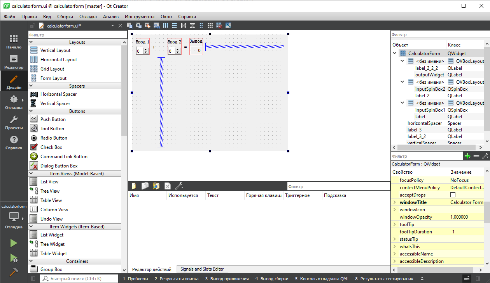

МИНИСТЕРСТВО НАУКИ  И ВЫСШЕГО ОБРАЗОВАНИЯ РОССИЙСКОЙ ФЕДЕРАЦИИ 
Федеральное государственное автономное образовательное учреждение высшего образования 
"КРЫМСКИЙ ФЕДЕРАЛЬНЫЙ УНИВЕРСИТЕТ им. В. И. ВЕРНАДСКОГО" 
ФИЗИКО-ТЕХНИЧЕСКИЙ ИНСТИТУТ 
Кафедра компьютерной инженерии и моделирования

 
<h3 align="center">Отчёт по лабораторной работе № 4  по дисциплине "Программирование"</h3>
  

студента 1 курса группы ПИ-б-о-201(2) 
Варивода Богдана Евгеньевича 
направления подготовки 09.03.04 "Программная инженерия"

  
<table>
<tr><td>Научный руководитель  старший преподаватель кафедры  компьютерной инженерии и моделирования</td>
<td>(оценка)</td>
<td>Чабанов В.В.</td>
</tr>
</table>
  

Симферополь, 2021

## Постановка задачи

Настроить рабочее окружение, для разработки программного обеспечения при помощи Qt и IDE Qt Creator, а также изучить базовые возможности данного фреймворка.

## Выполнение работы

### Задание 1
1. Для выполнения данной лабораторной работы необходимо было установить комплект Qt, который включает в себя мультиплатформенный графический фреймворк, а также IDE.
2. Был скачан и установлен Qt Creator с официального сайта. Компилятор MinGW установился в комплекте автоматически.

Рисунок 1. Установка Qt Creator

3. Далее был открыт пример **Calculator Form Example**
4. После этого были изменены текст форм "Input 1", "Input 2", "Output" на "Ввод 1", "Ввод 2" и "Вывод" соответственно.

Рисунок 2. Редактор форм Qt Creator

### Задание 2
1. **Как изменить цветовую схему (оформление) среды?** 
`Инструменты` -> `Параметры` -> `Среда` -> `Интерфейс` -> `Тема`

2. **Как закомментировать/раскомментировать блок кода средствами Qt Creator? Имеется ввиду комбинация клавиш или пункт меню.** 
`Ctrl+/`

3. **Как открыть в проводнике Windows папку с проектом средствами Qt Creator?** 
В редакторе выбрать файл (файл проекта также подойдет) -> нажать по нему ПКМ -> `Открыть в проводнике`

4. **Какое расширение файла-проекта используется Qt Creator? Может быть несколько ответов.** 
`<имя проекта>.pro` для сборщика QT 
`CMakeLists.txt` для сборщика CMake, а также файлы `*.cmake` для библиотек.

5. **Как запустить код без отладки?** 
Нажать на зелёный треугольник слева снизу или `Сборка` -> `Запустить (Ctrl+R)`

6. **Как запустить код в режиме отладки?** 
Нажать на зелёный треугольник с жучком (багом) слева снизу или `Отладка` -> `Начать отладку` -> `Начать отладку запускающего проекта (F5)`

7. **Как установить/убрать точку останова (breakpoint)?** 
Нажать слева от нумерации строки либо переместить курсор на нужную строку и нажать `Отладка` -> `Поставить/снять точку останова (F9)`

### Задание 3
**Чему равны переменные i и d в 6 строке?** 
- `d = 4.7952351524781363e-317` (Неинициализованное значение) 
- `i = 0` (Неинициализованное значение)

**Чему равны переменные i и d в 7 строкe?** 
- `d = 4.7952351524781363e-317` (Неинициализованное значение) 
- `i = 5`

**Чему равны переменные i и d в 8 строке?** 
- `d = 5` 
- `i = 5`

Каталоги:
[[Проект]](./qt)

## Вывод
По ходу работы с Qt Creator я научился 
- создавать проект,
- базово настраивать среду,
- редактировать некоторые параметры объектов в форме,
- редактировать форму и код в данном IDE,
- открывать примеры проектов и обучаться с их помощью.